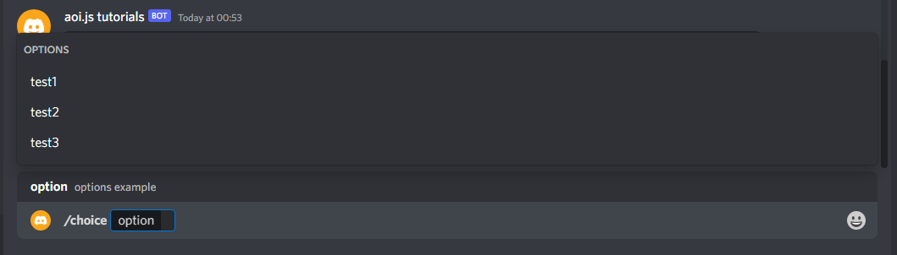

# using choices (slash commands)

this guide covers on how to use slash command choices, to get started make sure your bot has access to create slash commands on your current server if not then invite it with the `applications.commands` scope from dev portal


## getting started

to start off you can have an template example like this:\



```javascript
$createApplicationCommand[$guildID;choice;slash command choices showcase!;true;slash;[{
  "name": "option",
  "description": "options example",
  "required": true,
  "type": "STRING",
"choices" : [{
"name" : "test1",
"value" : "value1"
},{
"name" : "test2",
"value" : "value2"
},{
"name" : "test3",
"value" : "value3"
}]
}]
```


<figure><figcaption><p>output example after executing the command</p></figcaption></figure>

as you can see, this is a example, to simplify, `"name":` of choices names will be displayed on the slash command option that used to have the choices being created, value will be then used to respond to choices using multiple `$if`

## responding to choices

now that you have created your own slash commands with it's own choices, you can now make it respond by doing the following


```javascript
module.exports = {
name: "slash-command-name",
type: "interaction",
prototype: "slash",
$if: "v4",
code: `$if[$slashOption[slash-option-name]==choicevalue1]
$interactionReply[example of choice value 1 reply!]
$else
$if[$slashOption[slash-option-name]==choicevalue2]
$interactionReply[example of choice value 2 reply!]
$endif
$endif`
} // and so on that you can even add many
```

